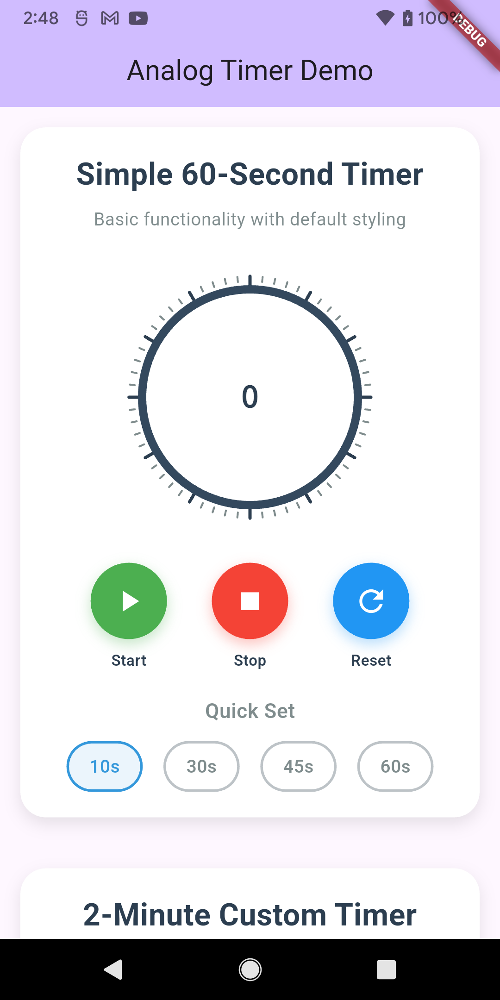
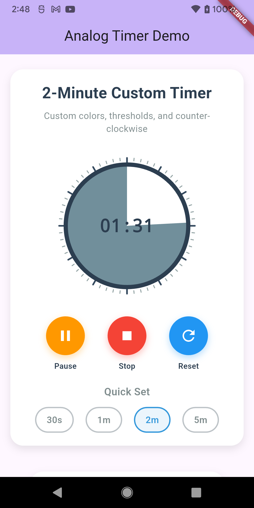

<div align="center">

# 🕐 Analog Timer

**A beautiful, customizable analog timer widget for Flutter**

*Perfect for countdown timers, pomodoro apps, quiz applications, and more*

[](https://pub.dev/packages/analog_timer)
[](https://opensource.org/licenses/MIT)
[](https://flutter.dev/)
[](https://dart.dev/)

</div>

---

## 📸 Screenshots

<div align="center">
  
| Timer Controls & Animations | Static Examples & Variations |
|:---:|:---:|
|  |  |
| Interactive timers with start/pause/reset controls | Different progress states and styling options |

</div>

## 📱 Platform Support

| Platform | Support |
|----------|:-------:|
| Android | ✅ |
| iOS | ✅ |
| Web | ✅ |
| macOS | ✅ |
| Windows | ✅ |
| Linux | ✅ |

> **Pure Dart Implementation**: This package contains only Dart code and custom painters, making it compatible with all Flutter platforms without any platform-specific dependencies.

## ✨ Key Features

<div align="center">

| Feature | Description |
|:-------:|:----------|
| 🎨 **Beautiful Design** | Circular analog timer with clean, modern aesthetics |
| 🎯 **Inside-Circle Progress** | Progress visualization fills the inside of the circle |
| ⚠️ **Warning Colors** | Automatic color transitions based on remaining time |
| 🔄 **Customizable Direction** | Clockwise or counter-clockwise progress |
| ⏱️ **Timer Functionality** | Start, pause, resume, reset, and stop functionality |
| 📱 **Time Display** | Shows remaining time inside the timer |
| 🎛️ **Full Customization** | Colors, sizes, thresholds, and more |
| 📏 **Interval Marks** | Visual time indicators around the clock face |
| ✨ **Smooth Animations** | Glow effects and smooth transitions |
| 💫 **No Dependencies** | Pure Flutter implementation with no external packages |

</div>

## 🎯 Use Cases

**Perfect for:**
- 🍅 **Pomodoro Timer Apps** - Work/break session timers
- 📝 **Quiz Applications** - Question time limits with visual feedback
- 🏃 **Fitness Apps** - Workout timers, rest periods, intervals
- 🍳 **Cooking Apps** - Recipe timers, cooking stages
- 📚 **Study Apps** - Focus sessions, break reminders
- 🎮 **Game Development** - Countdown timers, turn limits
- 📢 **Presentation Apps** - Speaking time limits
- 🚑 **Emergency Apps** - Critical countdown timers

## ⚡ Quick Start

```dart
// 1. Add to pubspec.yaml
dependencies:
  analog_timer: ^1.0.0

// 2. Import
import 'package:analog_timer/analog_timer.dart';

// 3. Use it!
AnalogTimer(
  progress: 0.75,
  remainingTimeText: '01:30',
  size: 200,
)
```

## 🚀 Installation

### 1. Dependency

Add this to your package's `pubspec.yaml` file:

```yaml
dependencies:
  analog_timer: ^1.0.0
```

### 2. Install

```bash
flutter pub get
```

### 3. Import

```dart
import 'package:analog_timer/analog_timer.dart';
```

## 📖 Usage

### Simple Timer

For basic usage with just a progress value:

```dart
AnalogTimer(
  progress: 0.75, // 75% time remaining
  remainingTimeText: '01:30',
)
```

### Timer with Controller

For full timer functionality with start/pause/reset:

```dart
class TimerPage extends StatefulWidget {
  @override
  _TimerPageState createState() => _TimerPageState();
}

class _TimerPageState extends State<TimerPage> with TickerProviderStateMixin {
  late AnalogTimerController _controller;

  @override
  void initState() {
    super.initState();
    
    // Initialize timer controller
    _controller = AnalogTimerController(
      duration: const Duration(minutes: 5),
      warningThreshold: 0.3, // Warning at 30% remaining
      criticalThreshold: 0.1, // Critical at 10% remaining
    );
    
    // Initialize animation (required for glow effects)
    _controller.initializeAnimation(this);
    
    // Set up callbacks
    _controller.onWarning = () => print('Warning: Time running low!');
    _controller.onCritical = () => print('Critical: Very little time left!');
    _controller.onExpired = () => print('Time expired!');
  }

  @override
  void dispose() {
    _controller.dispose();
    super.dispose();
  }

  @override
  Widget build(BuildContext context) {
    return Scaffold(
      body: Center(
        child: Column(
          mainAxisAlignment: MainAxisAlignment.center,
          children: [
            // Animated timer widget
            AnimatedBuilder(
              animation: _controller,
              builder: (context, child) {
                return AnalogTimer(
                  progress: _controller.progress,
                  isRunning: _controller.isRunning,
                  animationValue: _controller.animationValue,
                  warningLevel: _controller.warningLevel,
                  remainingTimeText: _controller.formattedTime,
                  size: 250,
                );
              },
            ),
            
            const SizedBox(height: 40),
            
            // Control buttons
            Row(
              mainAxisAlignment: MainAxisAlignment.spaceEvenly,
              children: [
                ElevatedButton(
                  onPressed: () {
                    if (_controller.isRunning) {
                      _controller.pause();
                    } else if (_controller.isPaused) {
                      _controller.resume();
                    } else {
                      _controller.start();
                    }
                  },
                  child: Text(_controller.isRunning 
                    ? 'Pause' 
                    : _controller.isPaused 
                      ? 'Resume' 
                      : 'Start'),
                ),
                ElevatedButton(
                  onPressed: _controller.reset,
                  child: const Text('Reset'),
                ),
              ],
            ),
          ],
        ),
      ),
    );
  }
}
```

### Custom Styling

```dart
AnalogTimer(
  progress: 0.6,
  direction: AnalogTimerDirection.antiClockwise,
  size: 300,
  circleColor: const Color(0xFF2C3E50),
  intervalColor: const Color(0xFF95A5A6),
  majorIntervalColor: const Color(0xFF34495E),
  timeTextColor: const Color(0xFF2C3E50),
  timeTextSize: 32,
  warningColors: const AnalogTimerWarningConfig(
    normalColor: Color(0xFF3498DB),   // Blue
    warningColor: Color(0xFFE67E22),  // Orange  
    criticalColor: Color(0xFFE74C3C), // Red
    warningThreshold: 0.4,            // Warning at 40%
    criticalThreshold: 0.15,          // Critical at 15%
  ),
)
```

## 📋 API Reference

### AnalogTimer

| Parameter | Type | Default | Description |
|-----------|------|---------| ----------- |
| `progress` | `double` | **required** | Progress value from 0.0 to 1.0 |
| `isRunning` | `bool` | `false` | Whether the timer is running |
| `animationValue` | `double` | `0.0` | Animation value for glow effect |
| `warningLevel` | `int` | `0` | Warning level (0=normal, 1=warning, 2=critical) |
| `direction` | `AnalogTimerDirection` | `clockwise` | Progress direction |
| `remainingTimeText` | `String?` | `null` | Text to display in center |
| `size` | `double` | `200` | Size of the timer widget |
| `circleColor` | `Color` | `Color(0xFF34495E)` | Outer circle color |
| `progressColor` | `Color?` | `null` | Override progress color |
| `intervalColor` | `Color` | `Color(0xFF7F8C8D)` | Small interval marks color |
| `majorIntervalColor` | `Color` | `Color(0xFF2C3E50)` | Major interval marks color |
| `timeTextColor` | `Color` | `Color(0xFF2C3E50)` | Time text color |
| `timeTextSize` | `double` | `24.0` | Time text font size |
| `warningColors` | `AnalogTimerWarningConfig` | default config | Warning color configuration |
| `enableWarningColors` | `bool` | `true` | Enable automatic warning colors |

### AnalogTimerController

| Method | Description |
|--------| ----------- |
| `start()` | Start the countdown timer |
| `pause()` | Pause the running timer |
| `resume()` | Resume the paused timer |
| `stop()` | Stop the timer completely |
| `reset([Duration?])` | Reset timer to original or new duration |
| `addTime(Duration)` | Add extra time to current timer |
| `subtractTime(Duration)` | Subtract time from current timer |
| `initializeAnimation(TickerProvider)` | Initialize animation controller |

| Property | Type | Description |
|----------| ---- | ----------- |
| `totalDuration` | `Duration` | Total timer duration |
| `remaining` | `Duration` | Current remaining time |
| `progress` | `double` | Progress value (0.0 to 1.0) |
| `isRunning` | `bool` | Whether timer is running |
| `isPaused` | `bool` | Whether timer is paused |
| `warningLevel` | `int` | Current warning level |
| `formattedTime` | `String` | Formatted time string |
| `animationValue` | `double` | Animation value for effects |

| Callback | Type | Description |
|----------| ---- | ----------- |
| `onTick` | `AnalogTimerCallback?` | Called every second |
| `onWarning` | `AnalogTimerCallback?` | Called when entering warning state |
| `onCritical` | `AnalogTimerCallback?` | Called when entering critical state |
| `onExpired` | `AnalogTimerCallback?` | Called when timer expires |
| `onTickWithTime` | `AnalogTimerTickCallback?` | Called every second with remaining time |

### AnalogTimerWarningConfig

| Parameter | Type | Default | Description |
|-----------|------|---------| ----------- |
| `normalColor` | `Color` | Green | Color when time is normal |
| `warningColor` | `Color` | Orange | Color when time is in warning state |
| `criticalColor` | `Color` | Red | Color when time is critical |
| `warningThreshold` | `double` | `0.5` | Warning threshold (0.0-1.0) |
| `criticalThreshold` | `double` | `0.2` | Critical threshold (0.0-1.0) |

## 🎯 Examples

Check out the `/example` folder for a complete Flutter application demonstrating all features:

- Simple 60-second countdown timer
- Custom 2-minute timer with different styling
- Static examples showing different states
- Interactive controls for start/pause/reset
- Custom warning thresholds and colors

### Running the Example

```bash
# Clone or download the repository
cd analog_timer/example

# Get dependencies
flutter pub get

# Run on your preferred platform
flutter run

# Or run on web
flutter run -d web-server --web-port 8080

# Or build for web
flutter build web
```

The example works on all supported platforms (Android, iOS, Web, macOS, Windows, Linux).

## 🤝 Contributing

Contributions are welcome! Please feel free to submit a Pull Request. For major changes, please open an issue first to discuss what you would like to change.

## 📝 License

This project is licensed under the MIT License - see the [LICENSE](LICENSE) file for details.

## 🐛 Issues

Please file issues on the [GitHub issues page](https://github.com/vignarajj/analog_timer/issues).

## 📧 Support

For questions or support, please visit [vignaraj.dev](https://vignaraj.dev) or open an issue on GitHub.
